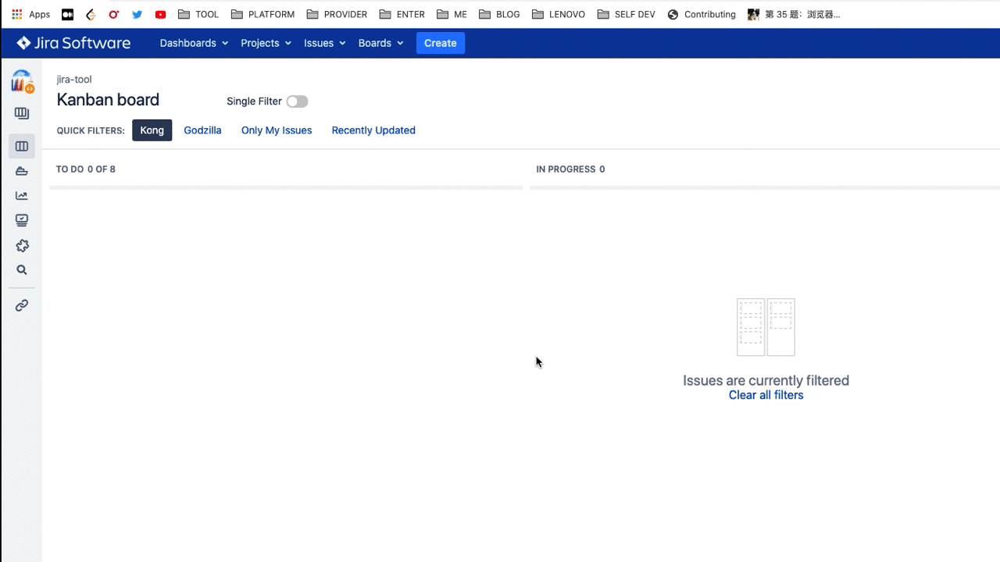

> 开启filter单选模式，支持方向键快速切换



## Design

- jira看板页面追加开关按钮，设置开启，开启时，捕获点击拦截器事件，取消其它已经active的filter
- 光标聚焦在看板filter中时，监听方向按键，计算光标所在元素位置信息，根据方向键盘+位置信息，获取移动后的目标元素信息，实现焦点获取
- 对于issue描述click事件进行拦截，实现禁用quick edit

在线测试地址:https://demo-jira.stiltsoft.com/secure/Dashboard.jspa

## Bundle

```shell
$ ./build.sh

```

## Install

1. 推荐使用 Chrome 商店安装

    ](https://camo.githubusercontent.com/f25540e08ab08d44f63117f2a30ed36b50ab2e034640cd2d567b31c844b8859b/68747470733a2f2f6a6a6263646e2e7a616f7368752e736f2f7765622f6377735f62616467655f343936783135302e706e67)
3. Unpacked Install
   
